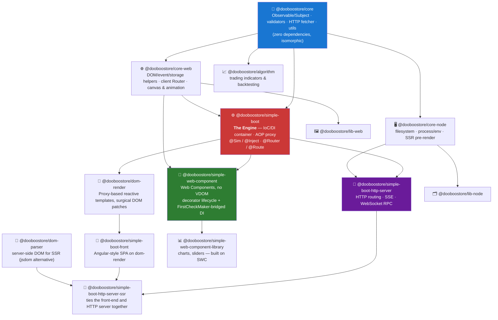
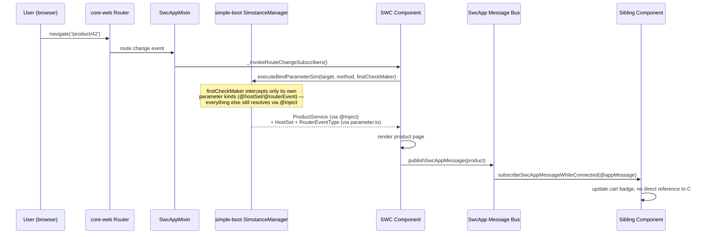
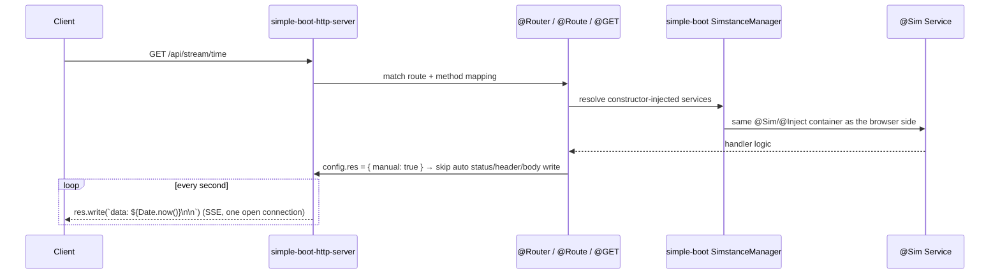

# 🚀 @dooboostore: The Ultimate Isomorphic Full-Stack TypeScript Framework

[](https://github.com/dooboostore-develop/packages/actions/workflows/main.yaml)
[](https://opensource.org/licenses/MIT)

**@dooboostore** is not just another utility library. It is a massive, highly-engineered **enterprise-grade full-stack framework** built entirely from scratch — no React, no NestJS, no Angular runtime underneath. Every layer, from the DI container to the DOM renderer to the HTTP server, is hand-built on the same small set of ideas, so that learning one package teaches you how to read all the others.

Say goodbye to context switching between frontend and backend. With `@dooboostore`, you write your server, SPA (Single Page Application), and SSR (Server-Side Rendering) logic using the exact same Object-Oriented paradigm — the same `@Sim`/`@Inject` container resolves a service on Node.js and in the browser, unmodified.

---

## 🧭 Design Philosophy

This isn't a loose bundle of packages that happen to share a scope prefix — it's one worldview, applied consistently at every layer. These are the rules that actually get enforced across the codebase, in the order they matter:

1. **One mechanism, everywhere: decorators + `Reflect` metadata.** Wiring a service in Node (`@Sim`/`@Inject`), binding a DOM event in the browser (`@addEventListener`), mapping an HTTP route (`@GET`/`@Route`), reacting to an attribute change (`@changedAttribute`) — under the hood it's always the same shape: a decorator stashes metadata via `Reflect`, and a lifecycle/container reads it back later. Learn that pattern once, in any package, and the internals of every other package stop looking foreign.

2. **Composition over modification — extension points, not forks.** `SimstanceManager`'s `FirstCheckMaker` hook is the clearest example: it lets `simple-web-component`'s lightweight parameter decorators (`@hostSet`, `@routerEvent`, `@appMessage`, ...) resolve *alongside* `simple-boot`'s full `@Inject` container resolution — on the exact same method — without either system knowing the other exists. A brand-new capability was bolted onto an old package by using a hook that was already there, not by rewriting the container.

3. **Backward compatibility is a hard constraint, not a courtesy.** Every new decorator capability has to leave old call sites working unchanged. Order-independent parameter injection in `simple-web-component`'s `@addEventListener` falls straight back to the original positional arguments the instant a method uses none of the new parameter decorators. The framework is allowed to grow; it isn't allowed to break what already worked.

4. **Explicit names over clever parameters.** Given a choice between one generic decorator with a config string (`@param('event')`) and many individually-named ones (`@eventObject`, `@matchedElement`, `@hostSet`, `@routerEvent`, `@appMessage`, ...), this ecosystem picks the latter — every time, even when it means a large export surface. `simple-web-component`'s event system alone ships `eventClick`, `eventClickDelegateLight`, `eventInputThis`, `eventKeydownWindow`... roughly **944 generated aliases** covering 59 DOM event types across every binding strategy. The cost is more exported names; the payoff is that autocomplete and the name itself teach you what a decorator does — nobody has to memorize a string enum.

5. **Isomorphic by construction, not by convention.** `@Sim`/`@Inject` is the *same* container on the server (`simple-boot-http-server`) and in the browser (`simple-web-component`). A service class written once can be constructor-injected into an HTTP route handler and into a Web Component's lifecycle method, with identical syntax and identical semantics.

6. **Verify by running it, not by reading it.** Decorators here are tested by booting a real browser or server and driving them, not just by code review. That habit is what surfaces the bugs that pure reading misses — e.g. a slot-binding decorator that silently threw on every call because of a stale `this` closure, undetected for a long time simply because nothing in the codebase exercised it yet. The ecosystem is large and moves fast, so not every corner is equally battle-tested — but the corners that get touched, get run, not just read.

---

## 🗺️ Architecture — How the Packages Layer



Everything sits on `@dooboostore/core` — the only package with zero dependencies on anything else here. `simple-boot` is the engine: it doesn't know or care whether it's running in Node or a browser tab, which is exactly what makes it possible to reuse the same `@Sim`/`@Inject` container in both `simple-web-component` (client) and `simple-boot-http-server` (server).

---

## 🔗 How It Actually Fuses — Two Real Request Flows

The diagrams below aren't hypothetical — they trace mechanisms that exist in the code today: `FirstCheckMaker` in `SimstanceManager`, the `res: { manual: true }` opt-out in `simple-boot-http-server`, and `simple-web-component`'s message bus.

### Client-side: a route change reaches three different systems at once



One method call resolves a full DI-container dependency and two lightweight parameter decorators side by side, then fans out to a component that has never heard of the one that triggered it — router, DI container, and pub/sub message bus, three different subsystems, one method signature.

### Server-side: the same DI container, a completely different runtime



Same decorators (`@Sim`, `@Inject`), same container, same mental model — the only thing that changed is which package hosts the runtime (`simple-boot-http-server` instead of `simple-web-component`). A service class doesn't need to know which side it's running on.

---

## ✨ Key Features

- 🌟 **True Isomorphic Architecture:** Share the same mental model across the entire stack. Use `@Sim` (our IoC container) and `@Inject` on both Node.js and the Browser.
- 💉 **Advanced DI & AOP Container (`simple-boot`):** A fully custom-built Dependency Injection container supporting Singleton/Transient lifecycles, Circular Dependency resolution, and ES6 Proxy-based AOP.
- ⚡ **Surgical Reactive DOM Engine (`dom-render`):** Forget Virtual DOM overhead. We use ES6 `Proxy` to detect state mutations and surgically patch only the exact affected DOM nodes in real-time.
- 🧩 **No-VDOM Web Components (`simple-web-component`):** Native Web Components with a decorator-driven lifecycle, order-independent parameter injection, and a lifecycle-plugin architecture (`ElementDefineLifeCycler`) that lets observers/timers/event-delegation all compose safely.
- 🔌 **Next-Gen WebSocket RPC & SSE:** Built-in multiplexing protocol that seamlessly packs JSON and Binary data (Files/Blobs) together without Base64 overhead, plus an opt-out (`res: { manual: true }`) for hand-rolled Server-Sent Events streaming.
- 🛠️ **Zero-Compromise OOP:** Embrace robust Object-Oriented Programming principles with heavily utilized Decorators and Reflection metadata.

---

## 📦 Ecosystem Packages

| Package | Description |
|---|---|
| **`@dooboostore/core`** | Zero-dependency foundational utilities — RxJS-like `Observable`/`Subject`, validators, geometry, an HTTP fetcher, and array/object/string/date/math helpers. |
| **`@dooboostore/core-node`** | Node-only utilities extending `core` — filesystem helpers, process/env info, memory profiling, SSR page pre-rendering. |
| **`@dooboostore/core-web`** | Browser-only utilities extending `core` — DOM/event/storage helpers, client-side routers, canvas & animation utils. |
| **`@dooboostore/algorithm`** | Stock/trading domain algorithms — trend & indicator detection (SMA/EMA/MACD/RSI/OBV) and a `TradingSimulator` for backtesting strategies. |
| **`@dooboostore/dom-parser`** | A lightweight, dependency-free server-side DOM implementation (a jsdom alternative) for SSR environments. |
| **`@dooboostore/lib-node`** | A Node.js utility for generating random placeholder images via server-side `canvas`. |
| **`@dooboostore/lib-web`** | Canvas-based browser UI widgets — a multi-layer image editor, GPS marker visualization, and polygon image cropping. |
| **`@dooboostore/simple-boot`** | The heart of the framework. A powerful IoC/DI container, AOP proxy manager, and declarative routing decorators. |
| **`@dooboostore/dom-render`** | A reactive, Proxy-based view template engine for DOM manipulation without VDOM. |
| **`@dooboostore/simple-boot-front`** | SPA framework integrating `simple-boot` and `dom-render` (Angular-style development). |
| **`@dooboostore/simple-web-component`** | A lightweight, no-Virtual-DOM front-end framework built directly on native Web Components — reuses `simple-boot`'s DI container with its own decorator + lifecycle-plugin rendering model. |
| **`@dooboostore/simple-web-component-library`** | A UI component library built on `simple-web-component` — chart components (cartesian/stock/radar/bubble/3D) and a range slider. |
| **`@dooboostore/simple-boot-http-server`** | A high-performance Node.js HTTP web server framework with declarative routing and a WebSocket RPC layer. |
| **`@dooboostore/simple-boot-http-server-ssr`** | Seamless SSR (Server-Side Rendering) extension tying the front-end and HTTP server frameworks together. |

---

## 💻 Quick Showcase

Experience the unified DX (Developer Experience). Here is how you write both backend and frontend code using `@dooboostore`.

### 1. Backend: HTTP Server & Dependency Injection
Just like Spring Boot, but in pure TypeScript.

```typescript
import { Sim } from '@dooboostore/simple-boot/decorators/SimDecorator';
import { Router, Route } from '@dooboostore/simple-boot/decorators/route/Router';
import { GET } from '@dooboostore/simple-boot-http-server/decorators/MethodMapping';
import { RequestResponse } from '@dooboostore/simple-boot-http-server/models/RequestResponse';

@Sim({ symbol: Symbol.for('UserService') })
export class UserService {
  getUser(id: string) {
    return { id, name: 'John Doe' };
  }
}

@Sim({ using: [UserService] })
@Router({ path: '/api' })
export class UserController {
  // Constructor Injection
  constructor(private userService: UserService) {}

  @Route({ path: '/users' })
  @GET({ res: { contentType: 'application/json' } })
  getUsers(rr: RequestResponse) {
    return this.userService.getUser('1');
  }
}
```

### 2. Frontend: Reactive Component (No Virtual DOM)
Define your logic, HTML, and CSS. The `@dooboostore/dom-render` engine handles surgical DOM updates via Reactive Proxies.

```typescript
import { Sim } from '@dooboostore/simple-boot/decorators/SimDecorator';
import { Component } from '@dooboostore/simple-boot-front/decorators/Component';
import { ComponentBase } from '@dooboostore/simple-boot-front/component/ComponentBase';

@Sim
@Component({
  selector: 'user-profile',
  template: `
    <div class="profile-card">
      <h2>Hello, \${@this@.user.name}\$!</h2>
      <button dr-event-click="@this@.save()">Save</button>
    </div>
  `,
  styles: [`.profile-card { padding: 20px; border: 1px solid #ccc; }`]
})
export class UserProfileComponent extends ComponentBase {
  // This state is automatically wrapped in a Reactive Proxy!
  user = { name: 'Guest' }; 

  save() {
    alert(`Saved: ${this.user.name}`);
  }
}
```

### 3. Frontend, the other way: Native Web Components (No Virtual DOM, No Framework Runtime)
Same DI philosophy, zero Virtual DOM, backed directly by the browser's own Custom Elements — and the same `@Inject` you just saw on the server works here too.

```typescript
import { elementDefine, onConnectedAfter, onConnectedBodyShadow, eventClick, hostSet } from '@dooboostore/simple-web-component';
import { Inject } from '@dooboostore/simple-boot';

@elementDefine('user-profile')
class UserProfile extends HTMLElement {
  user = { name: 'Guest' };

  @onConnectedAfter
  onconstructor(@Inject(UserService.SYMBOL) userService: UserService, @hostSet hs: any) {
    this.user = userService.getUser('1');
  }

  @eventClick('.save-btn')
  save() {
    alert(`Saved: ${this.user.name}`);
  }

  @onConnectedBodyShadow
  render() {
    return `<div class="profile-card"><h2>Hello, ${this.user.name}!</h2><button class="save-btn">Save</button></div>`;
  }
}
```

### 4. Advanced: WebSocket RPC & Binary Multiplexing
Send JSON and Binary Files together over WebSockets with ease. Wait for the server's response using standard `Promises`.

```typescript
// Client-side (Browser)
import { WebSocketClient } from '@dooboostore/simple-boot-http-server/websocket';

const ws = new WebSocketClient('ws://localhost:8080');
const topic = ws.subject('/api/upload');

// Send JSON + Native File Blob without Base64 encoding overhead!
const response = await topic.send({
  metadata: { userId: '123', action: 'upload_avatar' },
  avatar: fileInput.files[0] 
}).toPromise();

console.log('Server replied:', response);
```

---

## 🤝 Contribution
This is an ambitious project pushing the boundaries of what's possible with TypeScript. We welcome contributions, issue reports, and feature requests. 

## 📄 License
All packages in this repository are licensed under the [MIT License](https://opensource.org/licenses/MIT).
